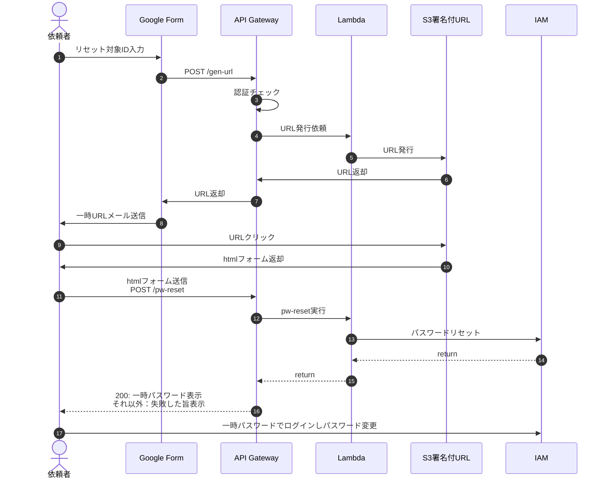

## 概要


GoogleフォームにユーザーIDを入力して送信すると、API Gatewayが受け取ってLambdaを実行する<br>
Lambdaでは、対象ユーザーのパスワードをリセットする

## 事前準備
1. tfstateを保存するバケットを作成
2. slackのwebhook作成
3. terraform実行用の環境変数を設定

```
cat <<EOS > terraform.tfvars
account_id = {AWSのアカウントID}
lambda_auth_value = "{任意の値。API Gatewayの認証用}"
sns_target = "{アラーム検知時の通知先。メールアドレス}"
slack_webhook_url = "{パスワード変更可否を送る管理者向けチャンネルwebhook}"
slack_webhook_for_user_url = "{パスワード完了を通知する、依頼者が所属するチャンネルwebhook}"
valid_domains = "{許可するメールドメイン。外部からのリクエスト拒否用}"
# 以下は変えたい場合のみ。デフォルトは900秒に100回API GatewayにリクエストがあればDDoSと判断
# alarm_period = "{デフォルト900秒。アラーム計測間隔}"
# alarm_threshold = "{デフォルト100。API Gatewayリクエスト数のアラーム閾値}"
EOS
```

## slack webhook設定
1. 「Incoming Webhooks」で、以下の2つのwebhookを作成する
  - パスワードリセットの承認可否をチャンネルに投稿するためのwebhook
  - パスワードリセットが完了したことを依頼者に通知するためのwebhook
2. 「Interactivity & Shortcuts」で、承認ボタンが押された際にリクエストを投げるAPI GWのendpointを設定する
  - ex) Request URL: https://{api_id}.execute-api.ap-northeast-1.amazonaws.com/pw-reset

## terraform実行

```
export AWS_PROFILE={もろもろ作成権限のあるPROFILE}

# 初期設定
terraform init -backend-config="bucket={作成したバケット名}"

# dry run
terraform plan

# execute
terraform apply
```

## Googleフォーム実行前作業
1. terraform実行後、アラート通知先のsns_targetにメールが届くので承認
2. scripts/GAS以下のスクリプトを、Googleフォームのスクリプトに設定。
  - フォームの項目名は「ユーザー名」
3. GASの「スクリプト プロパティ」に以下を設定
  - API_ENDPOINT: 以下参照
  - AUTH_VALUE: Lambda認証用。slack-workflowの環境変数で設定
  - ADMIN_EMAILs: 管理者に送信するメール(通知A用)

```
# API_ENDPOINTには、以下の「api_endpoint」を入力

$ terraform state show aws_apigatewayv2_api.pw_reset | grep '^\s*api_endpoint'
    api_endpoint                 = "https://{api_id}.execute-api.ap-northeast-1.amazonaws.com"
```

## シーケンス図

